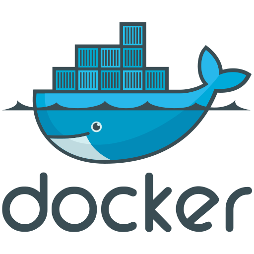
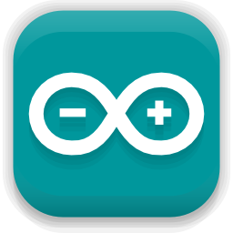

<h3>Full Stack | Python Dev | Java Dev</h3>

  
  

---

### About Me

I'm a Full Stack Developer passionate about clean code, efficient development, and artificial intelligence.

- Explore my work: [My repositories](https://github.com/Valpoli?tab=repositories)  
- My portfolio: [valpoli.github.io/my-portfolio](https://valpoli.github.io/my-portfolio/)  
- My resume: todo  

---

### Contact

- Email: valentin.poli7@gmail.com  
- LinkedIn: 

---

### My Tech Stack

#### Programming Languages

  
  
  
  
  

#### Frontend

  
  
  
  
  
  
  
  
  

#### Backend

  
  
  
  
  
  
  
  
  

#### AI Tools & Frameworks

  
  
  
  
  
  
  

#### Databases

  
  
  
  

#### DevOps

  
  
  
  

#### Cloud & Azure

  
  
  
  

#### Hardware & IoT

  
  
  

#### Testing

  
  

#### CLI & Code Quality

  
  
  

### Github activity

